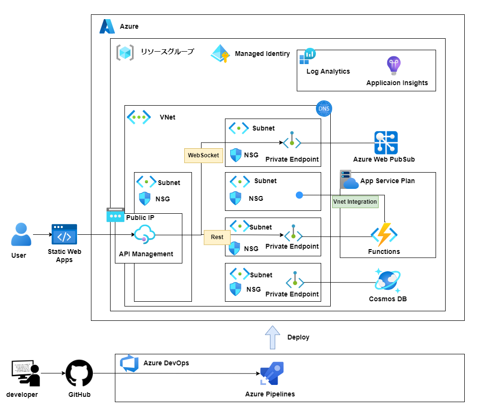

# Azure Web Pubsub を使ったチャットアプリ

## 概要

Azure Web Pubsub を使ったチャットアプリです。

## どんなアプリ？

TBD...

## アーキテクチャ



## 開発環境

本アプリケーションでは、以下の技術を採用しています。できる限り最新バージョンを使用しています。

### フロントエンド

フロントエンドは、SPA で構築し、Azure Static Web Apps でホスティングする前提で作成します。

| カテゴリ                    | 使用技術     | バージョン |
| --------------------------- | ------------ | ---------- |
| フレームワーク              | Remix        | ^2.14.0    |
| ランタイム                  | Node.js      | 22.11.0    |
| ビルドツール                | Vite         | ^5.1.0     |
| CSS                         | Tailwind CSS | ^3.4.4     |
| UI コンポーネントライブラリ | shadcn/ui    | -          |

### バックエンド

バックエンドは、Rest 通信を行う Azure Functions に載せるアプリケーションを作成します。

| カテゴリ       | 使用技術 | バージョン |
| -------------- | -------- | ---------- |
| 主要ライブラリ | .NET     | 8.0.400    |

### 基盤

本アーキテクチャは IaC（InfraStructure as Code）でインフラを構築します。

| カテゴリ   | 使用技術 | バージョン |
| ---------- | -------- | ---------- |
| IaC ツール | Bicep    | 0.31.34    |

## ローカルでの起動方法

本リポジトリをクローン後、以下のコマンドを使用し、依存モジュールのダウンロードを行います。

```bash
$ npm ci
```

以下のコマンドを実行するとコンソールに URL が表示され、ブラウザからアクセス可能です。

```bash
$ npm run dev
```
